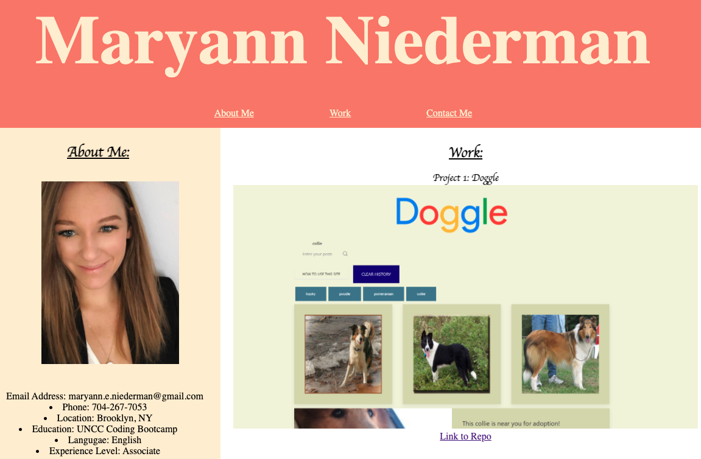

# Professional Portfolio

## Table of Contents

[*Description](#Description)

[* Requirements](#Requirements)

[* Installation](#Installation)

[* Contributing](#Contributing)

[* Credits](#Credits)


## Description

This repository houses my Personal Portfolio. This personal portfolio offers future employeers and opportunity to view my credentials. Links to Github repos are included as well as a Bio and Contact information. This portfilio is to be updated on an adhoac basis to show up to date information.

### Deployed Website



## Requirements
```
GIVEN I need to sample a potential employee's previous work
WHEN I load their portfolio
THEN I am presented with the developer's name, a recent photo, and links to sections about them, their work, and how to contact them
WHEN I click one of the links in the navigation
THEN the UI scrolls to the corresponding section
WHEN I click on the link to the section about their work
THEN the UI scrolls to a section with titled images of the developer's applications
WHEN I am presented with the developer's first application
THEN that application's image should be larger in size than the others
WHEN I click on the images of the applications
THEN I am taken to that deployed application
WHEN I resize the page or view the site on various screens and devices
THEN I am presented with a responsive layout that adapts to my viewport
```

## Installation

No need for any installation for this project.

See deployed site here: https://meniederman.github.io/ProfessionalPortfolio/

See repository here: https://github.com/meniederman/ProfessionalPortfolio


## Contributing

Any feedback is encouraged and appreciated for future improvements.

## Credits

Maryann Niederman 2021